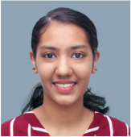
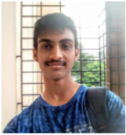
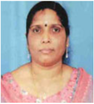
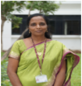

# Short term Hands on Supplementary Course on C Programming

This repo contains the material covered in the `Short-term Hands-on Supplementary Course in C Programming` for building C programming skills amongst the B.E. Computer Science & Engineering undergraduates in the [Computer Science & Engineering Department](https://www.ssn.edu.in/college-of-engineering/computer-science-and-engineering-department-ssn-institutions/) of [Sri Sivasubramaniya Nadar College of Engineering](https://www.ssn.edu.in/) through a practicum-driven lesson plan during May-July 2022.

## Team

| Nivedhitha D | Karthik D | Dr. B. Prabavathy | Dr. T. T. Mirnalinee |
| :----------: | :-------: | :---------------: | :-----------------: |
|||||
| | |||
|B.E. CSE 2018-2022|B.E. CSE 2019-2023|Associate Professor|Professor & Head of the Department|

## Objectives

- To lay solid foundations in C programming using a project-oriented practicum
- To ensure that students are able to implement theoretical concepts programmatically
- To promote collaborative learning by participating in coding parties and Ask Me Anything (AMA) sessions

## Outcomes
- Implement, compile, debug, and execute procedural programs in C
- Implement programs in C with appropriate data representation and programming constructs
- Organize programs into functions and modules
- Develop programming projects in C modularly and refine incrementally
- Write clean and well documented code

## Course Schedule

Course Details and Lesson Plan can be found [here!](./COURSE_DETAILS-Short-term_Hands-on_Supplementary_Course_on_C_Programming.pdf)

| Location & Timings | Session | Hands-On | Handout | Slides (PDF) | Code | Lecture Video |
| :----------------: | :-----: | :------: | :---: | :---: | :---: | :---: |
| 12-May-2022  02:30 - 3:40 PM  Seminar Hall | S01: C Programming Basics | `Tutorial:` Expression Evaluation | [H01-C_Programming_Basics](./Session01-C_Programming_Basics/H01-C_Programming_Basics.pdf) | [P01-C_Programming_Basics](./Session01-C_Programming_Basics/P01-C_Programming_Basics.pdf) | [Replit](https://replit.com/@NivedhithaD/Session01-CProgrammingBasics), [Github](./Session01-C_Programming_Basics/Programs) | `SOON` |
| 18-May-2022  06:30 - 8:00 PM  Online | S02: Conditional Statements | `Live Code Demo:` Finding greatest of 2, 3 numbers  `Tutorial:` Simple calculator | [H02-Conditional_Statements](./Session02-Conditional_Statements/H02-Conditional_Statements.pdf) | [P02-Conditional_Statements](./Session02-Conditional_Statements/P02-Conditional_Statements.pdf) | [Replit](https://replit.com/@NivedhithaD/Session02-ConditionalStatements), [Github](./Session02-Conditional_Statements/Programs) | [V02-Conditional_Statements](https://drive.google.com/file/d/12LWjD1_0ZemPFFiBWhMbgDdgY-LOWPsJ/view?usp=sharing) |
| 21-May-2022  06:30 - 8:00 PM  Online | S03: Looping Statements | `Tutorial:` Sum of n numbers, Factorial, Patterns | [H03-Looping_Statements](./Session03-Looping_Statements/H03-Looping_Statements.pdf) | [P03-Looping_Statements](./Session03-Looping_Statements/P03-Looping_Statements.pdf) | [Replit](https://replit.com/@KarthikDesingu/Session03-LoopingStatements), [Github](./Session03-Looping_Statements/Programs) | [V03-Iterative_Statements](https://drive.google.com/file/d/1QzN5dY6jnv0TBj0UPcYLZlOFTg5IrwVR/view?usp=sharing) |
| 25-May-2022  06:30 - 8:00 PM  Online | S04: Arrays | `Live Code Demo:` Linear Search, Matrix Addition and Multiplication `Tutorial:` Insertion and Deletion in Arrays | `SOON` | [P04-Arrays](./Session04-Arrays/P04-Arrays.pdf) | `SOON`| [V04-Arrays](https://drive.google.com/file/d/1nBv-SR-xToJtxwcT_zHmaJvHdSUg-5AC/view?usp=sharing) |
| 30-May-2022  06:30 - 8:00 PM  Online | S05: Array Operations | `Live Code Demo:` Linear Search (Revisit), Selection Sort `Tutorial:` Insertion Sort | `SOON` | [P05-Array_Operations](./Session05-ArrayOperations/P05-Array_Operations.pdf) | `SOON`| [V05-Array_Operations](https://drive.google.com/file/d/1Rm1FMGVtflB7LLAoIL4y1uV4kYI4yw3P/view?usp=sharing) |
| 04-June-2022  06:30 - 8:00 PM  Online | S06: Strings | `Live Code Demo:` String Copy, Case Conversion `Tutorial:` String Reversal | `SOON` | [P06: Strings](./Session06-Strings/P06-Strings.pdf) | `SOON`| [V06-Strings](https://drive.google.com/file/d/1rAxmLGbtyHDM-j-o9j1sJpZ0s5XAeVoL/view?usp=sharing) |
| 15-June-2022  06:30 - 8:00 PM  Online | S07: Functions | `Live Code Demo:` Linear Search, Swapping `Tutorial:` Increment a Variable (by Reference) | `SOON` | [P07-Functions](./Session07-Functions/P07-Functions.pdf) | [Replit](https://replit.com/@NivedhithaD/Session07Functions) | [V07-Functions](https://drive.google.com/file/d/1tt5yiBDzm3pR0gBAavxrjvhObFiSVhYk/view?usp=sharing) |

<!-- ## References

### Books

### Websites -->
